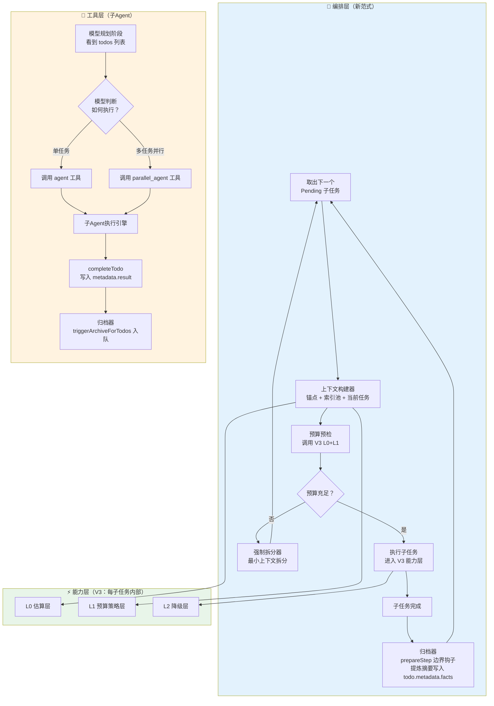
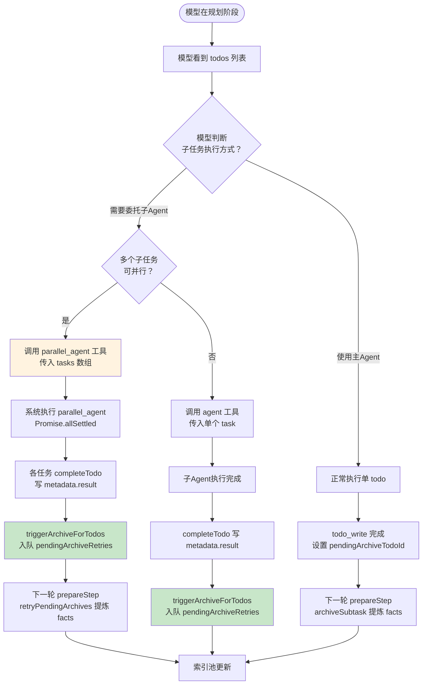

# Context State Management: TheThing Complete Design

> **状态**：**定稿** ｜ **日期**：2026-08-17 ｜ **关联**：`上下文压缩重构设计（V3）` + `子任务独立上下文范式`
>
> **一句话定位：V3 管好每步的"塞得进"和"写得完"，新范式管好每步的"从哪开始"和"之后去哪"。两者分层协作，共同构成 TheThing 长任务上下文的完整解决方案。**


## 0. 设计哲学：从"压缩"到"管理"

### 0.1 核心洞察

当前 TheThing 虽然用 `todos` 机制将任务拆成了子任务，但**所有子任务仍然跑在同一个不断增长的大上下文里**——所以才会溢出、才需要压缩。

**新范式的实质**：

> **把"跨子任务共享同一大上下文"改为"每个子任务独立执行、仅共享结论摘要"——溢出问题的土壤消失了。**

### 0.2 范式转变对比

| 维度 | 旧范式（响应式压缩） | 新范式（主动状态管理） |
| :--- | :--- | :--- |
| **核心操作** | 对不断增长的日志做减法（压缩） | 对不断产生的结论做加法（归档） |
| **跨子任务信息传递** | 继承完整历史（不断压缩） | **索引池有界注入，按需读回完整内容** |
| **上下文规模** | 随任务线性增长，O(n) | **每子任务恒定，O(1)**（索引池上限 50 条） |
| **估算的代价** | 估算错了 → 假超限卡死 | 估算错了 → 顶多触发拆分 |
| **压缩** | 主路径承重墙 | 降级为子任务内安全阀 |
| **失败处理** | L4 强制截断（语义断裂） | 强制拆分（保持语义完整） |

### 0.3 TheThing 产品形态确认

- **核心定位**：TheThing 是"把复杂任务交出去处理"的工具，聊天只是壳
- **简单问答**：不建 `todos`，走 `chat` 路径（`plan-prompt` 已内建判别）
- **复杂任务**：模型用 `todo_write` 建清单，进入任务执行流


## 1. 全景架构：两层协作

### 1.1 整体架构图



### 1.2 模块职责总览

| 层级 | 模块 | 职责 | 状态 |
| :--- | :--- | :--- | :--- |
| **编排层** | 上下文构建器 | 每子任务从零构建轻量上下文 | **新增** |
| **编排层** | 归档器 | 子任务完成时在 prepareStep 边界提炼摘要写入 `todo.metadata.facts` | **新增** |
| **编排层** | 强制拆分器 | 预算超限时最小上下文拆分兜底 | **新增** |
| **能力层** | L0 估算层 | BPE 精确估算 + usage 校准 + 缓存 | **已实现**（V3 Step 1-3） |
| **能力层** | L1 预算策略 | `deriveBudget`（触发线/硬限/目标） | **已实现**（V3 Step 1-3） |
| **能力层** | L2 降级层 | value 阶梯（截断/meta/落盘） | V3 保留 |
| **能力层** | 输出侧（§10） | 动态 outputReserve + 截断检测+续写 | V3 设计稿 |
| **能力层** | L4 失败层 | reactive retry + 诊断错误 | V3 保留 |

### 1.3 子Agent工具层

子Agent在新范式中作为**模型可调用的工具**存在。**并行决策完全由模型做出**，系统只负责执行和归档。

| 工具 | 职责 | 决策主体 | 说明 |
| :--- | :--- | :--- | :--- |
| **`agent`** | 单个子Agent执行 | 模型 | 模型在规划阶段决定将某个子任务委托给子Agent |
| **`parallel_agent`** | 并行子Agent执行 | 模型 | 模型在规划阶段决定将多个独立子任务并行委托给子Agent |

系统不主动检测并行候选，不替模型做并行决策。



**并行决策的提示与防护机制（设计决策，待实施）**

为确保模型能做出正确的并行决策，系统设计了三层配套机制：

| 层级 | 机制 | 说明 |
| :--- | :--- | :--- |
| **提示层** | `plan-prompt.ts` 包含并行决策引导 | 在规划阶段明确告知模型："如果存在多个相互独立的 `pending` 子任务（即它们之间没有 `blockedBy` 依赖），可使用 `parallel_agent` 工具并行执行；如有依赖，使用 `agent` 工具按顺序执行。" |
| **工具描述层** | `parallel_agent` 工具描述包含依赖检查指引 | 工具 description 明确说明："Tasks must be INDEPENDENT. Check the todos list: if any of these tasks have 'blockedBy' or 'depends on' dependencies, they are NOT independent and must be executed sequentially using the regular 'agent' tool." |
| **执行防护层** | `parallel_agent` 执行前检查 `blockedBy` | 工具执行前校验每个任务是否被 `blockedBy` 阻塞；若有依赖，返回 `success: false` 并给出降级指导："以下任务存在依赖，无法并行执行：{subjects}。请使用 `agent` 工具按顺序执行。" |

> **实施状态（2026-08-18）**：三层机制**已全部实现**——`plan-prompt.ts` 的 `buildPlanPrompt` 已含并行决策引导；`parallel_agent` description 已含 `blockedBy` 依赖检查指引；`parallel_agent` 执行前已校验 `blockedBy`（含依赖返回失败 + 降级指导）。

**模型决策的反馈闭环**：

当子Agent（`agent` 或 `parallel_agent`）完成执行后：
1. 系统将结论写入 `todos.metadata.result`
2. `triggerArchiveForTodos` 将结论入队 `pendingArchiveRetries`
3. 下一轮 `prepareStep` 经 `retryPendingArchives` 提炼 `facts` 写入 `todos.metadata.facts`
4. 下一轮上下文构建时，该结论自动进入索引池（短钩子格式）
5. 模型在下一轮规划时，通过索引池看到"已完成"的结论，据此判断后续子任务是否需要继续

这个闭环是"模型决策 → 系统执行 → 系统反馈（索引池）→ 模型再决策"的完整链路。索引池就是模型感知执行结果的信道。

> **实施状态**：闭环 5 步**均已实现**——步骤 2（`triggerArchiveForTodos` 接线）已接通（见 §5.2）；步骤 3 消费侧 `retryPendingArchives` 已实现；其余步骤已实现。

> **待设计对齐（2026-08-18）**：
> - **P0 子Agent 产出传递（已实施 2026-08-18）**：三部分框架落地（**不是**强制可解析格式，见 §5.3 架构校准）：
>   1. **契约定义**：`isSubstantiveDeliverable()`（`agent/deliverable.ts`）保守启发式——拦截空结果/executor 兜底文案，不设长度/关键词启发（避免误伤中文短结论）；指令层在 `buildSubAgentPrompt` 输出规范加"以 `## Final Conclusion` 收尾、不返回过程叙述"。
>   2. **交付物校验**：系统层，`agent-tool.ts`（`executeAgentTask`）与 `parallel-agent-tool.ts`（`executeSingleTask`）在 `executeRoutedAgent` 返回后校验。
>   3. **失败处理**：命中即降级——agent 路径返回失败 + 明确文案"未返回实质交付物…请用主Agent工具直接执行或重新委派"；parallel 路径单任务判失败、批次继续（部分失败隔离）。
>   说明：校验是保守兜底，只拦截明确无交付物；"过程叙述而非产物"主要由指令层在源头约束。
> - **P2 能力边界**：`explore`（只读）/`research`（web+只读）缺写文件能力是设计使然；错配在**路由**（搜索关键词任务→只读 explore）。建议在路由/工具描述层澄清适用场景，或新增"分析师"型 agent，而非简单加写工具。**（已解决 2026-08-18：路由层关键词自动路由移除，改为系统只提供运行环境、LLM 据各子Agent 适用场景/工具/能力边界自主选型；工具描述补充了每类型的能力边界标注）**

**用户感知**：
- 模型调用 `parallel_agent` 工具时，对话中显示并行处理提示（当前实现为 `SubAgentCard` 标题 `Parallel: N tasks`，见 `subagent-stream.tsx`）
- 每个子任务的进度通过 `todos` 面板展示（状态变为 `in_progress` → `completed`）
- 用户不需要说"并行"或"交给子Agent"，模型自动判断并执行

## 2. 已定决策

| 决策 | 结论 | 含义 |
| :--- | :--- | :--- |
| **执行单元** | `run` 内重建消息 | 保 UX（单一流/单一会话）；边界 = `prepareStep` 内重建点 |
| **日志去留** | 保留可读回 | 原始日志仍落库；只把"结论"装进上下文；需要时按需取回 |
| **摘要池来源** | **`todos.metadata.facts`（回退 `result`）** | 不新建 `subtask_summaries` 表，直接复用 `completed` 状态的 `todos`；读 `facts.conclusion` → 缺失回退 `result` 字符串 |
| **归档器写入** | **`todos.metadata.facts`** | 结构化 `{conclusion,key_facts,tool_chain}`；`metadata.result` 保持模型写入的人类可读字符串，schema 不改 |
| **边界判定** | **`pendingArchiveTodoId` 事件驱动** | 由 completed 事件触发归档与重建，不依赖 `in_progress` 状态（规避 0/多 in_progress 歧义） |
| **索引池上限** | **最多 50 条** | 索引池上限 50 条，每条短钩子约 40 tokens，**总索引池 ≤ 2,000 tokens**，O(1) 结构保证；按 `completedAt DESC` 取最近完成的 |
| **索引池注入格式** | **每行一个索引摘要** | `[已完成] {subject}：{结论短钩子}`，约 30-50 tokens/条；完整结论走 `todo_list({id})` 读回 |
| **摘要池淘汰** | **存储层全留不淘汰** | DB 保留所有 `completed` 状态 todo，便宜 |
| **人类参与** | **全自动跑完再汇报** | 用户不介入单子任务；`todos` 面板作进度展示 |
| **初始分解** | **复用现有 `todo` 创建** | 编排器只消费/推进，不新建分解机制 |
| **压缩定位** | **退居安全阀** | V3 L2/L3/L4 降级为子任务内部安全阀，不再作为跨子任务策略 |
| **归档开关** | **`enableSubtaskArchiving`（默认 `true`）** | 关闭时跳过事实归档，只留 `result` 字符串，不生成结构化 `facts` |
| **归档兜底** | **LLM 失败 → 跳过写 `facts`** | 提炼失败不写不完整 `facts`（避免污染索引池），记录 `archiving_failed` 告警，保留 `result` 字符串 |
| **归档触发条件** | **仅 `completed` 触发** | `failed` 不触发归档（failed 子任务的 facts 永不进索引池，避免白花 LLM 提炼） |
| **单完成约束** | **一次 `todo_write` 只完成/失败一个** | 违反时返回错误（非静默覆盖），防止多 todo 同时完成导致 `pendingArchiveTodoId` 单字段覆盖、其余子任务丢归档 |
| **拆分执行** | **`prepareStep` 内就地拆分** | 不 throw+catch（`createAgentUIStream` 无法中途重入流）；检测超限即就地拆 + 重建上下文 |
| **拆分产物依赖** | **平行无 `blockedBy`** | 拆分产物彼此独立、按创建顺序执行；顺序依赖应由初始规划用 `todo_create_batch.dependsOnSteps` 声明 |
| **并行决策主体** | **模型通过 `parallel_agent` 工具主动决定** | 系统不主动检测并行候选，不替模型做并行决策；模型在规划阶段看到 todos 列表后，自行判断是否存在可并行的独立子任务，调用 `parallel_agent` 工具执行 |
| **并行执行方式** | **模型调用 `parallel_agent` 工具（不改内部）** | 工具已内建 per-task todoId 状态同步 + `Promise.allSettled` 部分失败隔离 |
| **子Agent完成归档** | **`triggerArchiveForTodos` 入队 `pendingArchiveRetries`** | 子Agent（`agent`/`parallel_agent`）完成走 executor 的 `completeTodo`（路径 B），无父上下文消息切片，以 `metadata.result` 为输入走 `retryPendingArchives` 同路径（`pendingArchiveTodoId` 为单槽，批量用 Map 队列） |
| **可观测性** | **经 `compactionCallbackRef` 上抛** | `task_split`/`archiving_failed`/`index_pool_updated` 三事件经压缩状态通道推前端，支撑 Phase 5 统计与用户可见提示 |
| **并行决策提示层** | `plan-prompt.ts` 包含并行决策引导 + `parallel_agent` 工具描述映射到 `blockedBy` | 模型在规划阶段获得明确的并行决策指引；工具描述告知模型如何判断任务是否独立 |
| **并行决策防护层** | `parallel_agent` 执行前检查 `blockedBy` 依赖，有依赖则返回错误并降级指导 | 系统不执行模型做出的错误并行决策，而是给出明确的降级指导 |


## 3. 数据模型（基于现有 Todos 机制）

### 3.1 已有机制完全复用

**`todos` 表**（`schema.ts:659`）已有字段：

- `id`、`conversation_id`、`subject`、`status`（五态：`pending | in_progress | completed | failed | cancelled`）
- `completed_at`（完成时间戳）
- `metadata`（JSON 自由字段，已有 `result`/`error`/`verify` 结构）

**新范式不新建任何表**。已完成子任务的摘要信息从 `todos` 表中读取：

- `status = 'completed'` 的记录
- `metadata.result`（模型写的人类可读一行，字符串，schema 不动）
- `metadata.facts`（归档器写的结构化 `{conclusion, key_facts, tool_chain}`）
- 索引池读取优先级：`facts.conclusion` → 缺失则回退 `result` 字符串

### 3.2 `metadata` 结构规范

```json
{
  "result": "模块 A 与模块 B 存在循环依赖，已更新配置文件修复",   // 模型写入（人类可读一行，字符串）
  "facts": {                                                    // 归档器写入（结构化）
    "conclusion": "模块 A 与模块 B 存在循环依赖，已更新配置文件修复",
    "key_facts": [
      {"type": "file", "path": "/src/main.py", "version": "2.1"},
      {"type": "dependency", "from": "module_a", "to": "module_b"}
    ],
    "tool_chain": "read_file ×3, search_content ×1, write_file ×1"
  }
}
```

**消费规则**：
- 面板 / 快照：优先显示 `facts.conclusion`，回退 `result`
- 索引池：优先读 `facts.conclusion`，缺失回退 `result`；**再截断为短钩子注入**
- `todo_write` tool schema 不改（`result` 仍是 `z.string()`）

### 3.3 索引池构建查询

**实现方式（定稿修正）**：索引池在**应用层 JS** 构建，不走 SQL 下推。`buildCompletedTodoIndex` 调用 `getTodosByConversation` 全量读该会话所有 `todos`，再在 JS 里 `filter(status==='completed')` → 提取结论 → `sort(completedAt DESC)` → `slice(0, 50)`。

> 注意：这是**全量读该会话所有 `todos`**，不是 SQL `LIMIT 50`。单会话子任务数通常有限（几十到几百），全量读开销可忽略；若未来单会话子任务数达到数千级，再考虑将 `LIMIT` 下推到 SQL。

conclusion 取值：优先 `facts.conclusion`，回退 `result` 字符串；再截断为 50 字符短钩子。

### 3.4 与 Phase 1 已写代码的关系

**重要**：Phase 1 已写的 `subtask_summaries` 新表 + `SQLiteSubtaskSummaryStore` 代码**已被本设计取代**。

- 该代码未提交，应**归档或直接删除**
- 后续所有实现基于 `todos` 表读取摘要池，不再依赖新表


## 4. 模块一：上下文构建器（每子任务重置上下文）

### 4.1 挂载点

`agent-control/pipeline.ts` 的 `prepareStep({ stepNumber, messages, steps })`。

- **与 V3 关系**：V3 的 `compactBeforeStep` 在新范式下**退居子任务内安全阀**

### 4.2 边界判定（何时重建）

**事件驱动**（定稿修正）：不用 `in_progress` 状态作为边界唯一来源（规避 0/多 in_progress 歧义）。边界由 `completed` 事件触发——`todo-write-tool` 标记 `completed` 时设置 `sessionState.pendingArchiveTodoId`，下一轮 `prepareStep` 检测到即执行归档 + 重建。

```typescript
// prepareStep 内
if (sessionState.pendingArchiveTodoId) {
  // 1. 先归档上一子任务（此时 messages 含完整子任务消息，从 subtaskStartMessageIndex 到当前）
  await archiveSubtask(sessionState.pendingArchiveTodoId, messages);
  sessionState.pendingArchiveTodoId = null;

  // 2. 重建上下文（索引池 + 当前子任务）
  messages = buildSubtaskContext(sessionState);
  sessionState.subtaskStartMessageIndex = messages.length; // 记录新子任务起始锚点
}

// 正常流转：若无 pending 归档，且当前没有 in_progress，检查是否该激活下一个 pending
const nextTodo = getNextPendingTodo(conversationId);
if (nextTodo && !hasInProgressTodo(conversationId)) {
  // 自动激活下一个 pending，或通过上下文提醒模型激活
}
```

**消息锚点**：`sessionState.subtaskStartMessageIndex`（该子任务第一条消息在 `messages` 中的索引）在每次边界重建时设置，供归档器切片提取该子任务的完整消息链。

### 4.3 重建的上下文内容（不继承上一子任务的原始日志）

```
[系统指令]                              ← 保留 config.instructions（原样）
+ [全局锚点]                            ← 任务目标/约束（sessionState.goalState）
+ [索引池]                              ← 从 todos 读取已完成摘要（上限 50 条，completedAt DESC）
                                         每条渲染为一行（conclusion 截断至 40-50 字符）：
                                         [已完成] {序号}. {subject}：{conclusion_snippet}…
+ [当前子任务]                          ← 当前 todo.subject + 完成标准
+ [读回指针]                            ← 一行提示：
                                         "如需查看某条完整结论/关键事实/原始日志，
                                         调用 todo_list({ id: '...' }) 获取完整详情"
```

> **O(1) 保证**：索引行结论**必须截断为短钩子**（约 40 tokens/条），完整 conclusion 经 `todo_list({id})` 读回——若整行嵌入 ≤300 字结论，50 行将达 15K–22K tokens（中文），破坏 O(1) 的 ~2,000 tokens 数学。

> **与现有 snapshot 并存**：索引池（新增，最近 50 条 `completed`，长任务跨子任务认知连续性）与 `buildCompactTaskSnapshot`（现有，`in_progress`/`pending`/最近 3 条 `completed`/`failed`，进度面板）职责分工不同、**并存不取代**；snapshot 保留其 `completed` 段（与索引池重叠 3 条，约 300 tokens，可忽略）。索引池在上下文位置更靠前（优先级更高）。

> **分级索引（Phase 5 评估，未实施）**：当前索引池为**单级**——所有结论统一截断为 50 字符短钩子，完整内容一律经 `todo_list({id})` 读回。若 Phase 5 端到端观测发现模型**频繁** `todo_list` 读回近期已完成子任务（`todo_list` 查询率 > 阈值，如 80%），说明近期结论的心智价值高于远期——届时再引入**分级索引**：最近 N 条（如 5 条）保留较长结论，其余仍为短钩子，降低读回频次。此设计**暂不实施**，仅依赖 Phase 5 统计驱动决策。

### 4.4 预算预检 + 就地拆分（调用 V3 L0+L1）

重建后，调用 V3 的估算层 + 预算策略进行预检：

```typescript
const precheck = estimateRequestBudget(messages, instructions, tools, model, contextLimit, outputTokens);

if (precheck.shouldTrigger) {
  // 超限 → 就地拆分（不 throw）：取消当前 todo + 创建 2-5 个新子任务，
  // 重建上下文并切到第一个新子任务。在 prepareStep 内完成，避免 throw+catch 的重入问题。
  const created = splitTodo(todoStore, current, { model });
  if (created.length > 0) {
    recordTaskSplit(...);   // 遥测
    messages = buildSubtaskContext(newTodos);
  }
  // created.length===0 → 已原子无法拆分，交由现有 budget gate 处理（不发超限请求）
}
```

> **定稿修正**：不再 `throw TaskTooComplexError`（该类已删除）。拆分在 `prepareStep` 内**就地**完成——chat 路径用 `createAgentUIStream`（SDK 管理 SSE，无法中途重入流），抛错交由 run-loop 捕获不可行。

### 4.5 验收标准

- [ ] 跨子任务后，上下文**不包含**上一子任务的工具输出/中间推理
- [ ] 边界由 `pendingArchiveTodoId` 事件驱动，不依赖 `in_progress` 状态
- [ ] 上下文**包含**索引池（从 `todos` 读取已完成摘要，上限 50 条，**结论截断为短钩子**）
- [ ] 预算预检使用 V3 L0+L1，不依赖字符估算
- [ ] 预检超限时就地拆分（不 throw），拆分事件经遥测上抛


## 5. 模块二：归档器（子任务完成 → 提炼摘要入池）

### 5.1 触发点（prepareStep 边界钩子）

归档器**不放在 `todo-write-tool` 内部**（保持纯工具，不引入 LLM 调用）。分工：

- **`todo-write-tool`**：标记 `completed` 时 ① 写入 `metadata.result`（模型写的人类可读一行，`z.string()` 不变）② 标记状态为 `completed` ③ 设置 `sessionState.pendingArchiveTodoId = todoId`
- **`prepareStep`**：检测到 `pendingArchiveTodoId` 非空时执行归档（下一轮，此时 `messages` 含该子任务完整消息链）

### 5.2 时序约束

**同步 await**（吸取 checkpoint 异步竞态教训）；在 `prepareStep` 边界、**上下文重建之前**完成，确保归档时该子任务消息仍在 `messages` 中：

```typescript
// prepareStep 内，检测到 pendingArchiveTodoId 时：
await archiveSubtask(todoId, messages, subtaskStartMessageIndex); // 先归档
sessionState.pendingArchiveTodoId = null;
// 再重建上下文（见 §4.2）
```

**子Agent完成路径（path B，§1.3）**：子Agent（`agent`/`parallel_agent`）在子 Agent 内执行，父上下文**没有其消息切片**，`archiveSubtask` 的切片输入不适用。executor 已把子 Agent 结论写入 `metadata.result`（`completeTodo`）；用 `triggerArchiveForTodos` 以 `metadata.result` 为输入入队 `pendingArchiveRetries`，下一轮 `prepareStep` 经 `retryPendingArchives` 走与线性任务相同的 LLM 提炼→写 `facts` 路径（`pendingArchiveTodoId` 为单槽，批量用 Map 队列）。不变式保持：**所有 `completed` 的 todo 都经归档器提炼 `facts`**。

> **接线状态（2026-08-18）**：`triggerArchiveForTodos` **已接通**。`agent` 与 `parallel_agent` 共用 `executor.ts:266-268` 的接线点（均在 `executeRoutedAgent` 完成处、`completeTodo` 之后），一个接线点覆盖两条路径：`executor.ts` 在 `completeTodo` 之后调用 `triggerArchiveForTodos([todoId], todoStore, pendingArchiveRetries)` 入队；`AgentToolConfig`/`AgentExecutionContext` 已增加 `pendingArchiveRetries` 字段（`Map<string, string>`，与 `sessionState.pendingArchiveRetries` 同一引用，经 `tools.ts` 传入）。下一轮 `prepareStep` 经 `retryPendingArchives` 提炼 `facts`。

- **`completedAt` 类型（定稿修正）**：存储层（SQLite `completed_at` TEXT 列）为 ISO8601 字符串 `new Date().toISOString()`；应用层 `Todo.completedAt` 为 `number` epoch 毫秒（`parseRow` 用 `new Date(...).getTime()` 转换）。索引池按 `completedAt` **数值排序**（`(b - a)`），结果正确。
- 归档器写入 `metadata.facts`，不改 `metadata.result` 字符串

### 5.3 摘要提炼方式

**方式**：调用 LLM（非流式 `generateText`），复用 V3 的 `emergency-summary.ts` 摘要通道。

**成本说明**：每个子任务完成时额外一次非流式 LLM 调用（约 1-2 秒 RTT）。这是新范式的真实成本，已在设计中如实记录。

**功能开关 `enableSubtaskArchiving`（默认 `true`）**：

- 关闭时（`enableSubtaskArchiving: false`）跳过事实归档——`todo-write-tool` 仍写 `metadata.result`（模型写入的人类可读字符串），但不生成结构化 `facts`。
- 用于需要精确控制（成本/隐私/稳定性）的场景，或归档 LLM 不可用的运行时。

**LLM 失败 → 重试一次，仍失败才跳过写 `facts`**（定稿修正）：

- 提炼失败（全模型候选均无法产出合法 JSON）时，**不写不完整的 `facts`**，避免污染索引池（索引构建依赖 `facts.conclusion` / `result` 的 `COALESCE`，残缺 `facts` 会破坏其语义）。
- **重试机制**：首败时缓存该子任务的**已渲染文本**入 `pendingArchiveRetries` 队列（todoId → text），下一轮 `prepareStep` 用同一文本自动重试一次（`retryPendingArchives`，最多一次）。
  - 重试成功 → 写 `facts`，清出队列。
  - 重试仍失败 → 跳过写 `facts`，上抛 `archiving_failed` 事件到可观测性通道，清出队列。
  - 不阻塞主流程：`todo` 的 `completed` 状态已写入即推进，即使归档失败任务也继续。
- 只保留 `metadata.result` 字符串。
- 索引池读回依赖 `result` 字符串作为兜底，仍能索引该子任务。

**输入**（从 `messages` 切片提取，无需访问 `todo-write-tool`）：
- `messages[subtaskStartMessageIndex..当前]` —— 该子任务完整消息链
- 工具调用链
- 最终 assistant 输出

**系统提示**（精简）：

```
你是一个任务结果摘要助手。请将以下子任务的执行过程和结果提炼为：
1. tool_chain：工具链摘要（≤100 字符）
2. conclusion：最终结论（≤300 字符）
3. key_facts：结构化关键事实列表（JSON 数组）
```

**输出 JSON**：

```json
{
  "tool_chain": "read_file ×3, search_content ×1",
  "conclusion": "模块 A 与模块 B 存在循环依赖，已修复",
  "key_facts": [
    {"type": "file", "path": "/src/main.py", "version": "2.1"},
    {"type": "dependency", "from": "module_a", "to": "module_b"}
  ]
}
```

**蒸馏可靠性（2026-08-18 加固）**：`invalid_response` 的根因是蒸馏 LLM 输出无有效 JSON（多为输出截断/纯散文），而非"JSON 外有说明文字"——`parseFactsJson` 已容错（剥代码围栏 + `extractJsonObject` 提取 `{}` 片段）。加固项：

- **`json_object` 模式**：`summarizeFactsFromText` 对 OpenAI 兼容 provider 传 `providerOptions.openai.response_format = { type: 'json_object' }`，强制输出合法 JSON（非 OpenAI provider 忽略该选项，无回归）。不用 `Output.object()` 结构化 schema——其要求 provider 支持且改返回 shape，与 `fallbackModels` 兼容性有风险。
- **紧凑 `ARCHIVE_PROMPT`**：显式 JSON 模板 + `key_facts ≤ 5 条` + 禁止 markdown 围栏/前后缀，减小输出体积、降低截断概率。
- **输出预算**：`maxOutputTokens` 500 → 800（截断是无效 JSON 的常见成因）。
- **诊断增强**：`[invalid_response]` 日志补充响应长/是否含 `{}`/输入长，便于区分截断、缺字段、纯散文三类根因。

> **架构校准（2026-08-18）**：归档的 `facts` JSON 由**独立蒸馏 LLM 调用**生成，子Agent 的 `summary`/`result` 只是**输入源文本**，不是待解析的 JSON。因此"在子Agent 系统提示中强制纯 JSON 返回"是**反效果**——①不提升蒸馏成功率（那是另一次模型调用）；②破坏主Agent 读取子Agent 产出做综合（纯 JSON 不可读）；③破坏用户可见的 `SubAgentCard` 摘要。**不要按此实施**。

### 5.4 写入逻辑

```typescript
// 1. 写入 todos.metadata.facts（结构化，归档器产物）
await updateTodoMetadata(todoId, {
  facts: {
    conclusion: result.conclusion,
    key_facts: result.key_facts,
    tool_chain: result.tool_chain
  }
});
// metadata.result 保持模型写入的字符串，不动（todo_write schema 不变）

// 2. 状态已完成（completed_at 已由 todo-write-tool 用 toISOString 设置）
```

### 5.5 验收标准

- [ ] 每个子任务完成时，`todos.metadata.facts` 包含 `conclusion`/`key_facts`/`tool_chain`；`metadata.result` 仍是模型写的字符串
- [ ] 归档在 `prepareStep` 边界、上下文重建之前同步完成（`pendingArchiveTodoId` 驱动）
- [ ] `completedAt` 为 ISO8601 字符串，用于索引池 `ORDER BY completed_at DESC`


## 6. 模块三：强制拆分器（终极兜底）

### 6.1 触发条件

- **触发点 A**：上下文构建器预算预检失败（`estimatedTokens > triggerTokens`）
- **触发点 B**：`prepareStep` 内部 L1/L2 安全阀失效（极少）

### 6.2 执行流程（就地拆分，定稿确认）

**定稿修正（就地拆分而非 throw+catch）**：原设计通过 `throw TaskTooComplexError` 交由 run-loop 捕获。但因 chat 路径使用 `createAgentUIStream`（SDK 管理 SSE，无法中途重入流），**拆分须在 `prepareStep` 内就地完成**——检测到超限即取消当前 todo、创建新子任务、重建上下文并切到第一个新子任务，不抛错中断流。

```
1. prepareStep 检测到预算超限（L0+L1 预检，zone A）
2. 就地执行强制拆分（生成最小上下文 · generateText 或语义兜底）
3. 拆分结果写回 todos：把超限子任务 cancelled，创建新子任务（2-5 个）
4. 就地重建上下文，指向第一个新子任务
5. 记录 TaskSplitEvent 遥测（reason / 新子任务数 / 超限前后估算 tokens）
```

> 若子任务已原子（无法拆出 ≥2 个），`splitTodo` 返回空数组，调用方不重试，交由现有 budget gate 处理（不发超限请求被 provider 拒）。

### 6.3 最小上下文保证（安全措施）

```typescript
// 强制使用最小上下文，确保拆分调用本身绝不超限
const minimalMessages = [
  { role: 'system', content: systemPrompt },
  { role: 'user', content: `请将以下任务拆分为 2-5 个独立的子任务：${todo.subject}` }
];

// 用 V3 L0 估算层验证
const tokens = estimateFullRequest(minimalMessages, modelName);
if (tokens > 2000) {
  // 连最小上下文都超限 → 兜底：强行按语义切分
  return fallbackSplit(todo.subject);
}
```

### 6.4 Todos 更新逻辑

```typescript
// 1. 将当前 todo 标记为 cancelled（保留其 ID，不删除）
store.updateTodo({ id: todo.id, status: 'cancelled' });

// 2. 创建新子任务（无前向依赖）
for (const item of items.slice(0, 5)) {
  store.createTodo({ conversationId, subject: item.subject, ...(item.verify ? { metadata: { verify: item.verify } } : {}) });
}
```

> **定稿修正（拆分产物平行无依赖）**：拆分出的子任务**彼此无 `blockedBy` 依赖**，按创建顺序平行执行。拆分的本质是"分而治之"，产物应逻辑独立；若确有顺序依赖，应由模型在**初始规划**时用 `todo_create_batch` 的 `dependsOnSteps` 声明，而非在拆分时强行附带。

### 6.5 收敛性证明

- 每次拆分至少将一个子任务拆为 2 个
- 当子任务缩小到"单次工具调用"级别时，上下文必 < 100 tokens
- 数学收敛保证，不存在无限循环


## 7. V3 能力层的整合与处置

### 7.1 L0 估算层（已实现）

| V3 实现 | 新范式整合点 |
| :--- | :--- |
| `primitives/tokenizer/`（BPE 精确估算） | 上下文构建器预算预检调用 |
| `usage-calibrator.ts`（真值校准） | 每步成功后更新，自动适配模型 |
| `message-token-cache.ts`（消息级缓存） | 估算时复用，避免重复编码 |

**状态**：已实现（V3 Step 1-3，commit `029eba5/5cc9e0e`）

### 7.2 L1 预算策略层（已实现）

| V3 实现 | 新范式整合点 |
| :--- | :--- |
| `deriveBudget` → `triggerTokens` | 上下文构建器判断"是否触发拆分" |
| `deriveBudget` → `hardLimitTokens` | 安全阀激进降级的触发线 |
| `deriveBudget` → `targetTokens` | 压缩后目标（安全阀使用） |

**状态**：已实现（V3 Step 1-3，commit `029eba5/5cc9e0e`）

### 7.3 L2 降级层（保留为安全阀）

| V3 机制 | 新范式处置 |
| :--- | :--- |
| value 阶梯（截断/meta/落盘） | **保留**，作为子任务内安全阀 |
| 跨消息预算（`messageBudget`） | **保留**，处理单步超大工具结果 |
| 读循环熔断 / TTL 老化 | **保留**，不变式继续生效 |

### 7.4 L3/L4 紧急压缩（降级）

| V3 机制 | 新范式处置 |
| :--- | :--- |
| L2.5 确定性摘要 | **保留**，作为安全阀的一部分 |
| L3 LLM 摘要 | **降级**：仅在子任务内触发，不影响跨子任务 |
| L4 强制截断 | **保留**：作为极端兜底，新范式下极少触发 |

### 7.5 输出侧（§10 设计稿）

| V3 设计 | 新范式整合点 |
| :--- | :--- |
| 动态 `outputReserve` | 子任务内安全保障 |
| 截断检测（finishReason + 文本完整性） | 每步结束后检查，防止半截结果提交 |
| 截断后续写 | 检测到截断后自动续写 |

**状态**：设计稿，待实施


## 8. 实施路线图（修正版）

### Phase 1 — 验证现有 V3 L0+L1 能力（1天）

| 任务 | 验证 |
| :--- | :--- |
| 验证 `primitives/tokenizer/` 可用 | 对真实会话，估算误差 < 10% |
| 验证 `deriveBudget` 可用 | 单元测试覆盖小窗口/大窗口 |
| 删除所有残余魔法阈值 | `grep` 确认压缩模块无魔法比例 |

**注意**：`subtask_summaries` 新表 + `SQLiteSubtaskSummaryStore`（Phase 1 已写代码）**已被本设计取代**，应归档或删除。

### Phase 2 — 索引池 + 上下文构建器（2天）

| 任务 | 验证 |
| :--- | :--- |
| 在 `prepareStep` 中实现子任务边界判定（`pendingArchiveTodoId` 事件驱动） | 跨子任务后上下文不含上一子任务原始日志 |
| 实现索引池构建（从 `todos` 读取已完成摘要，上限 50 条） | 上下文包含索引池（[已完成] {subject}：{conclusion}） |
| 接入 V3 L0+L1 进行预算预检 | 超限时 `throw TaskTooComplexError` |

### Phase 3 — 归档器（1.5天）

| 任务 | 验证 |
| :--- | :--- |
| 实现摘要提炼（复用 V3 摘要通道或独立调用） | 单测：模拟子任务消息切片 → 提炼 → 写入 `todo.metadata.facts` |
| 在 `prepareStep` 边界挂载归档器（`pendingArchiveTodoId` 驱动） | 子任务 `completed` 后，`metadata.facts` 有记录，`result` 保持字符串 |
| 设计决策中明确记录"每子任务边界一次额外 LLM 调用"成本 | 文档说明完成 |
| 在 `executor.ts` 中 `completeTodo` 之后接通 `triggerArchiveForTodos`，将 `sessionState.pendingArchiveRetries` 传入 `AgentToolConfig` | 子Agent（`agent`/`parallel_agent`）完成后的 todo 进入 `pendingArchiveRetries`，下一轮 `retryPendingArchives` 提炼 `facts`；单测验证归档入队 + 提炼路径完整 |

### Phase 4 — 强制拆分器（1.5天）

| 任务 | 验证 |
| :--- | :--- |
| 在编排层（run-loop 边界）实现 `TaskTooComplexError` 捕获 | 预检失败 → 拆分 → 重入，用户无感知 |
| 实现最小上下文拆分（复用 `generateText`） | 超限 → 最小上下文 → 拆分 JSON → 用 `todo_create_batch` 写入 |
| 实现兜底规则拆分 | LLM 失败时按句号/段落语义切分 |

### Phase 5 — 端到端验证（2天）

| 验证项 | 方法 |
| :--- | :--- |
| **不变量 1**：上下文不随子任务数增长（O(1) 结构保证） | 运行 100+ 子任务长任务，日志断言索引池饱和（50 条）后上下文 Token 恒定 |
| **不变量 2**：不抛 `CONTEXT_BUDGET_EXCEEDED` | 真实长任务回归（小红书 case） |
| **不变量 3**：已完成子任务结论在后续上下文中可见 | 检查上下文含索引池记录 |
| **不变量 4**：归档器同步写入完成 | 子任务完成时 `metadata.result` 立即可读 |


## 9. 风险与缓解

| 风险 | 严重性 | 缓解 |
| :--- | :--- | :--- |
| **索引池上限 50 条可能不够** | 低 | 50 条 × 40 tokens = 2,000 tokens，占窗口比例极小；如需扩容，调整上限即可 |
| **`metadata.facts` 结构不规范** | 中 | 归档器以 LLM 生成 + 校验兜底保证结构化；`buildTodoSyncReminder` 强化对 `result` 的格式要求；索引池对 `facts.conclusion` 缺失回退 `result` |
| **摘要提炼 LLM 调用失败** | 中 | 兜底：将 `finalOutput` 首段（≤300 字符）作为 `conclusion` |
| **跨子任务依赖断裂** | 低 | `key_facts` 结构化 + `todo_list({id})` 读回完整详情；模型可主动拉取 |
| **预算预检估算仍可能出错** | 低 | V3 L0 用 BPE + usage 校准是业界最精确方案；超限时走拆分而非压缩 |
| **强制拆分器无限递归** | 极低 | 每次拆分至少将一个子任务拆为 2 个；单工具调用级别必过预算 |


## 10. 与 Phase 1 已写代码的关系

**重要**：Phase 1 已写的 `subtask_summaries` 新表 + `SQLiteSubtaskSummaryStore` 代码已被本设计取代。

| 原 Phase 1 工作 | 处置方式 |
| :--- | :--- |
| `subtask_summaries` 表定义（schema v20 迁移） | 撤销迁移，删除表定义 |
| `SQLiteSubtaskSummaryStore` 实现 | 删除或移入 `archive/` |
| DataStore 接口扩展 | 回退接口变更 |
| session 注入相关接线 | 回退变更 |

**未来实现直接复用 `todos` 表**，不新建任何持久化结构。


## 11. 完成标准

1. ✅ V3 L0+L1 验证完成，所有魔法阈值删除
2. ✅ 上下文构建器在子任务边界重建消息，不继承上一子任务原始日志
3. ✅ 索引池从 `todos` 读取已完成摘要（上限 50 条），O(1) 上下文恒定
4. ✅ 归档器在 prepareStep 边界（`pendingArchiveTodoId` 驱动）同步提炼摘要写入 `todo.metadata.facts`；`metadata.result` 保持模型写的字符串；受 `enableSubtaskArchiving` 开关控制；LLM 失败时跳过写 `facts`（不污染索引池）
5. ✅ 强制拆分器在预算超限时触发，拆分后用 `todo_create_batch` 更新 `todos`
6. ✅ 端到端验证：100+ 子任务长任务，上下文不随子任务数增长，不抛 `CONTEXT_BUDGET_EXCEEDED`
7. ✅ Phase 1 已写的 `subtask_summaries` 代码已归档/删除，无残留技术债务
8. ✅ 回归基线：现有 `scenario-invariants` / `guaranteed-compaction` / `db-replay` 全绿


## 12. 一句话总结

```text
V3 管好每步的"塞得进"和"写得完"，
新范式管好每步的"从哪开始"和"之后去哪"。
跨子任务共享的是"索引"而非"全量日志"——
O(1) 承诺通过索引池上限 50 条结构保证。
```
